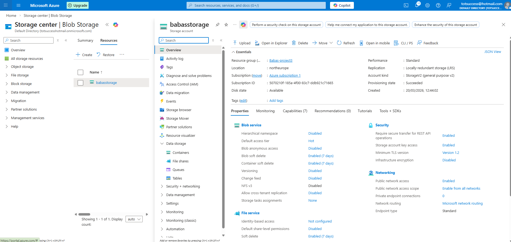
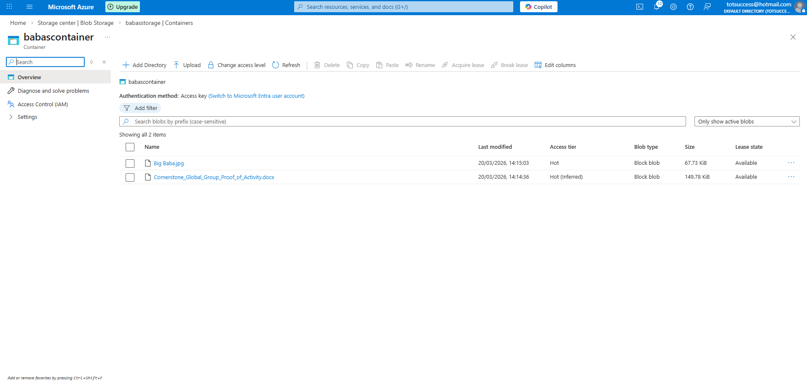
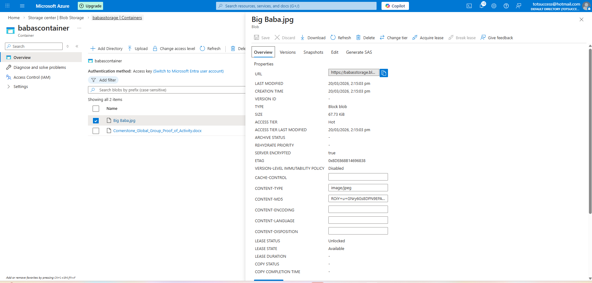
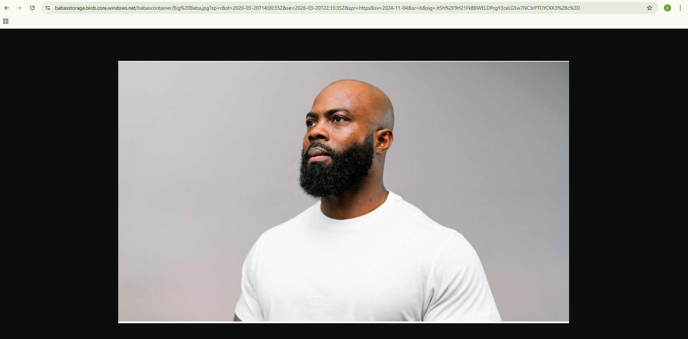

# 🚀 Azure Project 3 – Storage & Secure File Sharing

## 📌 Project Overview
This project demonstrates how to securely store and share files in Microsoft Azure using Blob Storage and Shared Access Signatures (SAS).

---

## 🎯 Objectives

- Understand Azure Storage Accounts  
- Upload and manage files using Blob Containers  
- Generate secure access links (SAS)  
- Share files without exposing storage keys  

---

## 🏗️ What I Built

- Azure Storage Account  
- Blob Container  
- Uploaded file to Azure  
- Generated SAS (Shared Access Signature)  
- Accessed file securely via browser  

---

## 🔐 Key Concept – SAS (Shared Access Signature)

SAS allows secure, time-limited access to storage resources without exposing your account keys.

- Controlled permissions (Read only)  
- Set expiry time  
- Secure external sharing  

---

## 🧪 Validation

- Generated SAS URL  
- Opened file in browser without login  
- Confirmed secure access works  

---

## 🧠 Skills Learned

- Azure Blob Storage fundamentals  
- Secure file sharing in cloud  
- Access control via SAS tokens  
- Storage account structure  

---

## 📸 Screenshots

### 🗂️ Storage Account Created

### 📦 Blob Container Created

### 📤 File Uploaded to Blob Storage

### 🔗 SAS Link Generated & Working

---

## 🚀 Next Steps

- Implement lifecycle management (Hot → Cool → Archive)  
- Explore Azure File Shares  
- Integrate storage with applications  
