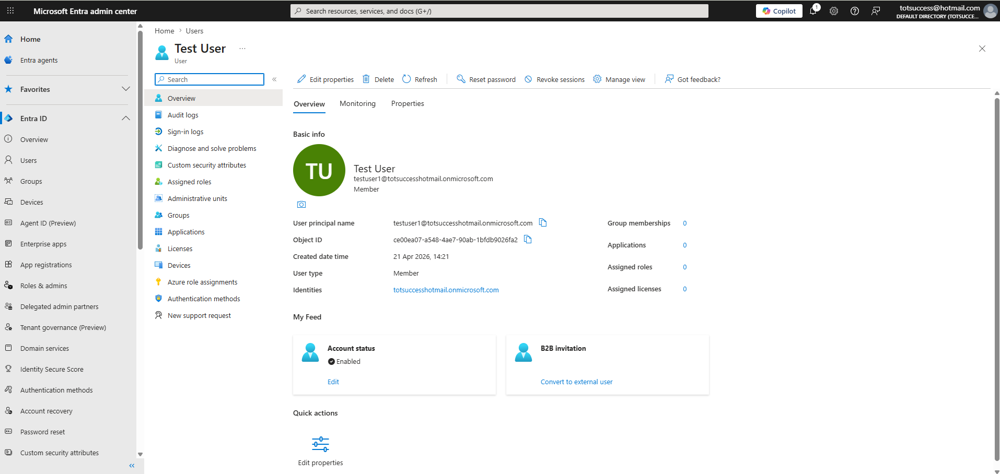
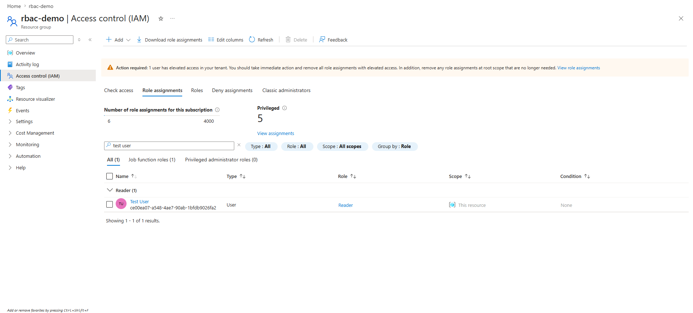
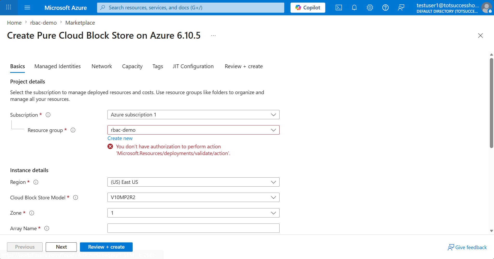

# 🔐 Project 5 – Identity and Access Management (RBAC)

## 📌 Overview
This project demonstrates how Azure controls access to resources using Role-Based Access Control (RBAC) and the principle of least privilege.

## 🔧 Technologies Used
- Azure Entra ID
- Azure RBAC
- Azure Resource Groups

## 🎯 Objectives
- Create a new user in Azure Entra ID
- Assign RBAC roles to control access
- Restrict access to a specific resource group
- Validate permissions through testing

## 🔑 Skills Learned
- Role-Based Access Control (RBAC)
- Identity security
- Least privilege access
- Scope-based access management

## 🧪 What I Built
- Created a test user in Azure Entra ID
- Created a dedicated resource group for access control testing
- Assigned the **Reader** role to restrict changes
- Verified restricted access as the test user
- Changed the role to **Contributor** to compare permissions

## 📚 Topics Covered
- Azure Entra ID
- Role assignments
- Built-in Azure roles
- Resource group scope
- Least privilege principle

## 📸 Screenshots

### User Created in Entra ID

### Resource Group Created

### Reader Role Assigned

### Access Restricted for Reader

### Contributor Role Assigned

## 💡 Key Takeaway
Azure RBAC makes it possible to control exactly who can access resources and what actions they can perform. This project helped me understand how least privilege improves security by limiting unnecessary permissions.

## ✅ Status
Completed
